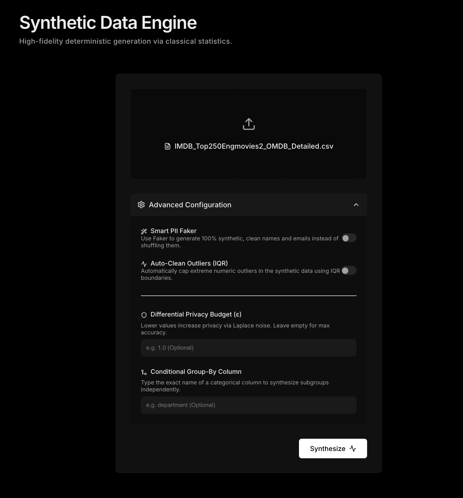
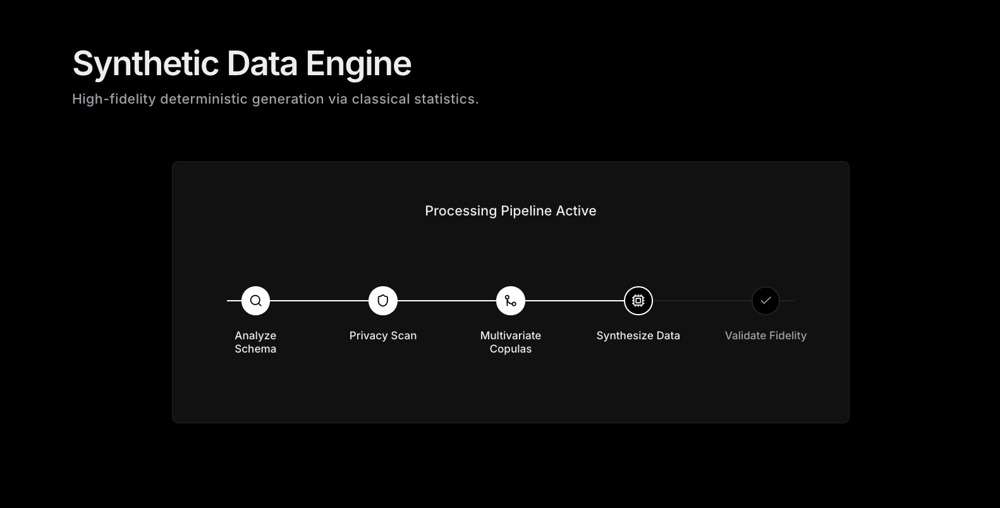
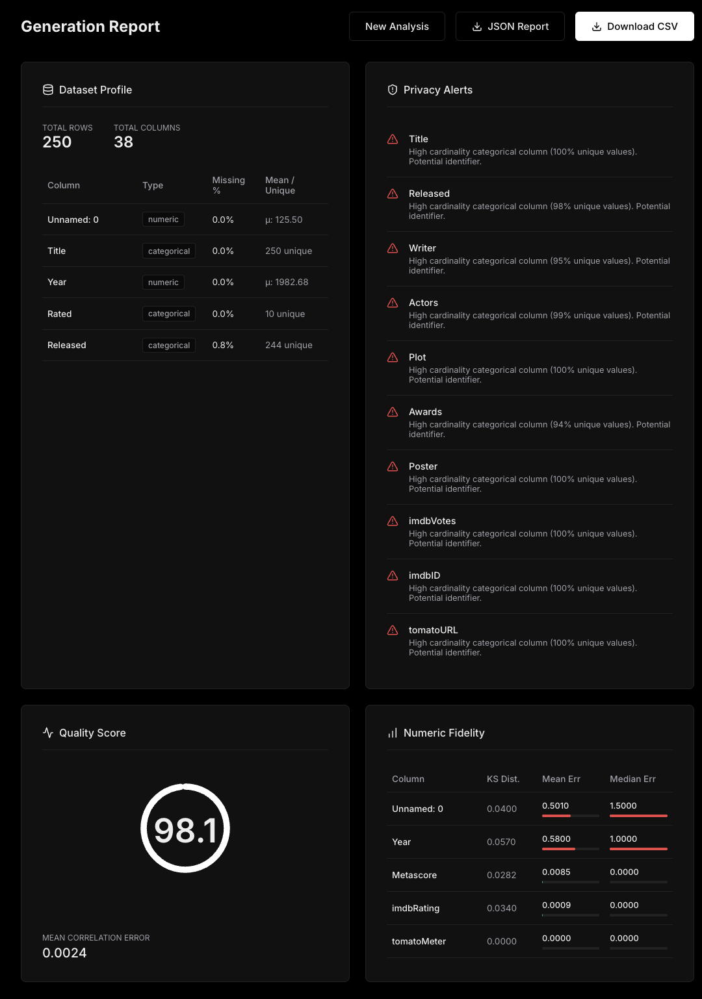
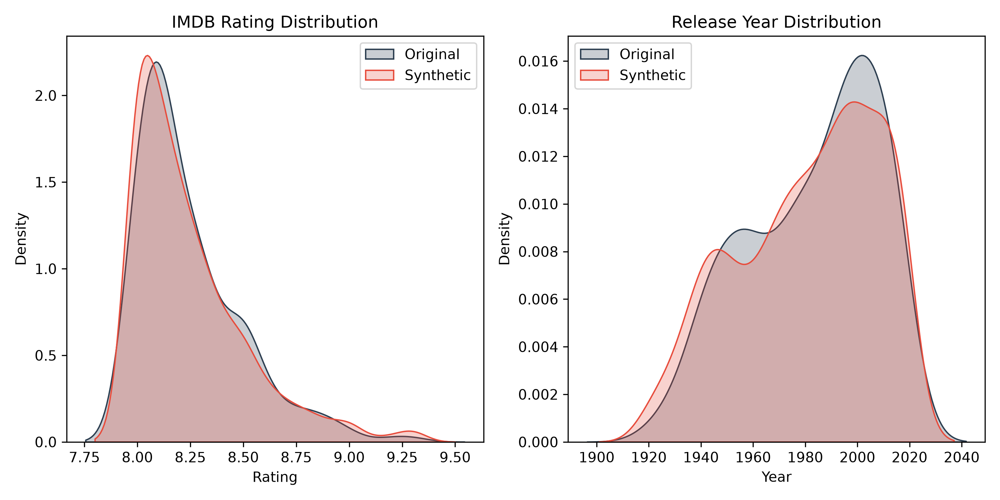
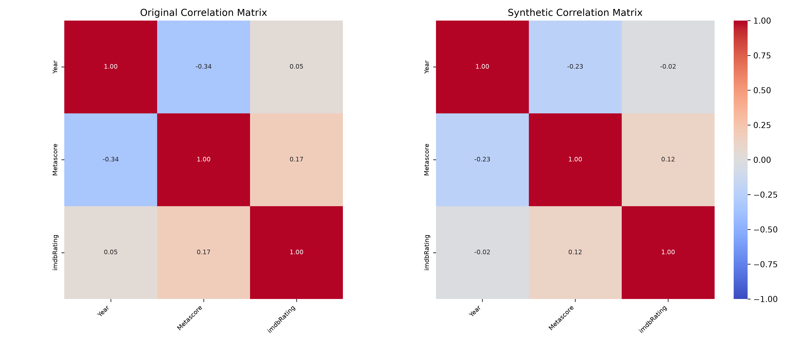
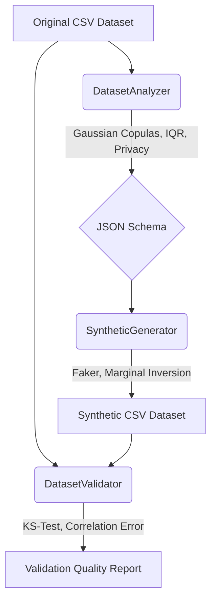

# Synthetic Data & Quality Analyzer


A professional, statistically rigorous synthetic data generation and quality validation pipeline built for modern data engineering teams.

This project enables you to mathematically analyze any CSV dataset, infer statistical distributions and marginal probabilities, and synthesize highly realistic mock data while strictly protecting original data privacy. No Machine Learning or LLMs are used—just pure classical statistics, Numpy, and Pandas.

## Key Features

- **Gaussian Copula Generation**: Models complex multi-dimensional correlations between numeric variables to preserve their statistical relationships.
- **Differential Privacy (Laplace Mechanism)**: Adds controlled mathematical noise to statistical parameters (mean, std) ensuring strong privacy guarantees (epsilon = 1.0) against reconstruction attacks.
- **Auto-Outlier IQR Cleaning**: Automatically mitigates heavy skew and capping outliers using Interquartile Range (IQR) bounds during analysis.
- **Smart PII Semantics (Faker)**: Automatically detects columns like `first_name`, `email`, and `address`, and generates hyper-realistic fake semantic replacements rather than randomized categorical text.
- **Conditional Sub-schemas**: Intelligently groups related data logically (e.g., separating numeric distributions by categorical labels) for unmatched realism.
- **Primary Key Safety**: Detects highly unique identifier columns (e.g., `id`, `uuid`) and securely sequences them (`ID-1`, `ID-2`) without duplicating.
- **Dynamic Precision Matching**: Infers the exact decimal precision or integer status of numeric data and strictly enforces formatting on the generated output.

## Dashboard Preview





## Visual Quality

The generation engine outputs data that matches both the shape and the underlying correlations of your real data.


*Preserving the marginal distributions (shape) of the original data.*


*Preserving the feature correlations via Gaussian Copulas.*

## Tech Stack

- **Backend / Engine**: Python 3.13, Pandas, Numpy, Scipy (ks_2samp, copulas), Faker, FastAPI, Pytest.
- **Frontend / UI**: React 18, Vite, Tailwind CSS, Recharts.

## Getting Started

### Prerequisites
- Python 3.9+
- Node.js 18+ and npm

### Environment Setup
```bash
# Clone the repository
git clone https://github.com/anirban222777das/Synthetic-Data-Quality-Engine.git
cd synthetic-data-quality

# Create and activate python virtual environment
python3 -m venv venv
source venv/bin/activate  # (On Windows use `venv\Scripts\activate`)

# Install backend dependencies
pip install -r requirements.txt
```

### Frontend Setup
```bash
cd frontend
npm install
cd ..
```

### Running the Dashboard
A convenience script is included to automatically start both the FastAPI backend and the React frontend locally:

```bash
# Ensure your virtual environment is active!
chmod +x start_dashboard.sh
./start_dashboard.sh
```
- **Dashboard UI**: [http://localhost:5173](http://localhost:5173)
- **API Backend**: [http://localhost:8000](http://localhost:8000)

## Architecture Pipeline

The system is decoupled into three primary engines communicating via a standardized JSON schema.



- **`DatasetAnalyzer`**: Ingests a DataFrame, computes means, standard deviations, categorical frequencies, IQR bounds, identifies PII semantics, and computes the Gaussian Copula correlation matrix.
- **`SyntheticGenerator`**: Consumes the extracted JSON schema. Generates new variables from independent margins, applies the Cholesky decomposition for copula correlation, and synthesizes safe textual data.
- **`DatasetValidator`**: Compares the source and synthetic data using the Kolmogorov-Smirnov test and numerical matrix differences to score generation quality.

## Limitations

- **Structured Data Only**: This engine is designed exclusively for structured tabular data (CSVs). It does not generate or process unstructured text, images, or audio.
- **No Cryptographic Anonymity**: While Differential Privacy (Laplace) masks aggregate statistics, this tool does not provide rigorous mathematical guarantees like k-anonymity for individual outliers unless extreme IQR clipping is enforced.
- **Memory Bound**: The entire dataset is loaded into Pandas memory for analysis. For datasets exceeding your machine's RAM, data should be chunked or pre-sampled.

## Development

If you wish to contribute or modify the underlying mathematics, a robust test suite is included to ensure statistical integrity.

```bash
# Run the complete test suite
pytest tests/ -v
```

## Documentation

For deep technical details on the underlying mathematics and algorithms, see the `/docs` folder:
- [Architecture](docs/architecture.md) - System design and data flow pipeline.
- [Methodology](docs/methodology.md) - Details on Copulas, IQR cleaning, and Faker.
- [Privacy](docs/privacy.md) - Details on the Laplace Mechanism.
- [Validation](docs/validation.md) - Details on the KS-test and correlation scoring.
- [Limitations](docs/limitations.md) - Known bounds on data types and memory.
- [Development](docs/development.md) - Instructions for testing and contributing.

## Why Synthetic Data?


*Because data is everywhere, but privacy isn't. This engine ensures your engineering teams can build, test, and scale without ever exposing production PII.*

## License

This project is licensed under the MIT License.
