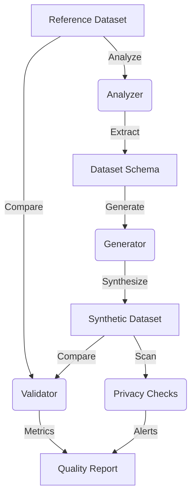

# Architecture

The Synthetic Data Quality Analyzer is designed with a strictly decoupled, modular architecture to ensure that statistical extraction, data synthesis, and validation remain independently testable.

## Core Data Flow

The system processes data in a strictly linear pipeline:

## Module Responsibilities

### `analyzer.py` (DatasetAnalyzer)
**Responsibility**: Learn statistical representations from a reference dataset without retaining the underlying data.
- Infers column types.
- Extracts univariate statistical moments (mean, std dev, skewness).
- Computes empirical discrete distributions and cardinality.
- Calculates correlation matrices.
- Returns a strict `DatasetSchema` object.

### `schema.py` (DatasetSchema)
**Responsibility**: Provide a serializable, mathematically complete snapshot of the original dataset.
- Operates as the boundary object between analysis and generation.
- Decouples the generator from the original reference data to ensure synthetic generation relies only on aggregated statistics.

### `generator.py` (SyntheticGenerator)
**Responsibility**: Synthesize tabular data conforming to the constraints defined in the `DatasetSchema`.
- Applies univariate generation strategies (e.g., empirical binning, truncated normal distributions) based on learned skewness.
- Uses Gaussian Copulas via the Iman-Conover method to impose the reference correlation matrix onto the independently sampled marginal distributions.
- Ensures strict adherence to min/max boundaries and missing-value distributions.

### `validator.py` (DatasetValidator)
**Responsibility**: Statistically compare the generated synthetic dataset against the original reference dataset.
- Executes Kolmogorov-Smirnov distance calculations.
- Quantifies mean/median shift errors.
- Measures correlation-matrix deterioration to compute the mean absolute correlation error.
- Yields a composite `quality_score`.

### `privacy.py` (PrivacyScanner)
**Responsibility**: Detect potential identifier exposure.
- Implements string-matching heuristics to detect probable identifier column names (e.g., "id", "email").
- Calculates uniqueness ratios to warn against high-cardinality features that risk becoming pseudo-identifiers.

## API & Frontend Integration

The core logic operates purely in Python/pandas, but the repository also ships with an integrated REST API and web dashboard.

- **`api.py`**: A thin FastAPI wrapper that exposes the core python pipeline to HTTP requests.
- **`frontend/`**: A Vite + React application providing a visual pipeline and detailed data-profiling grids.
